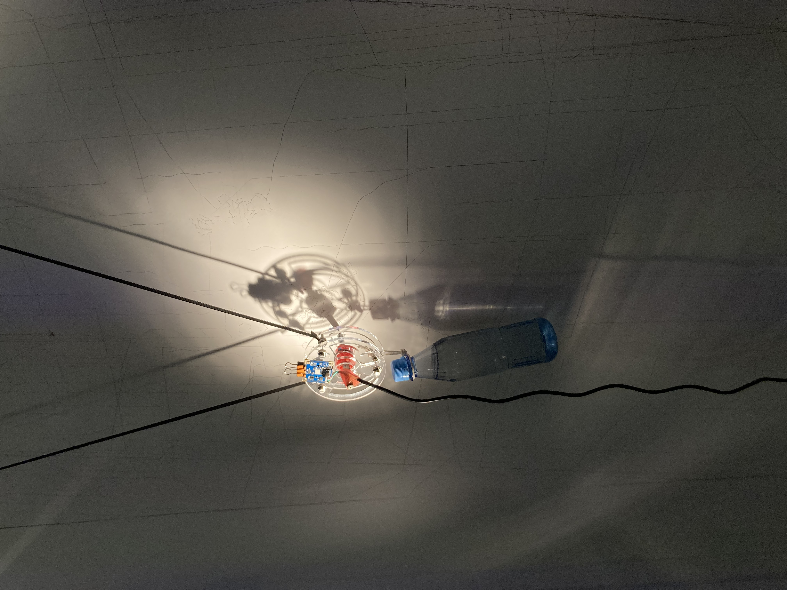
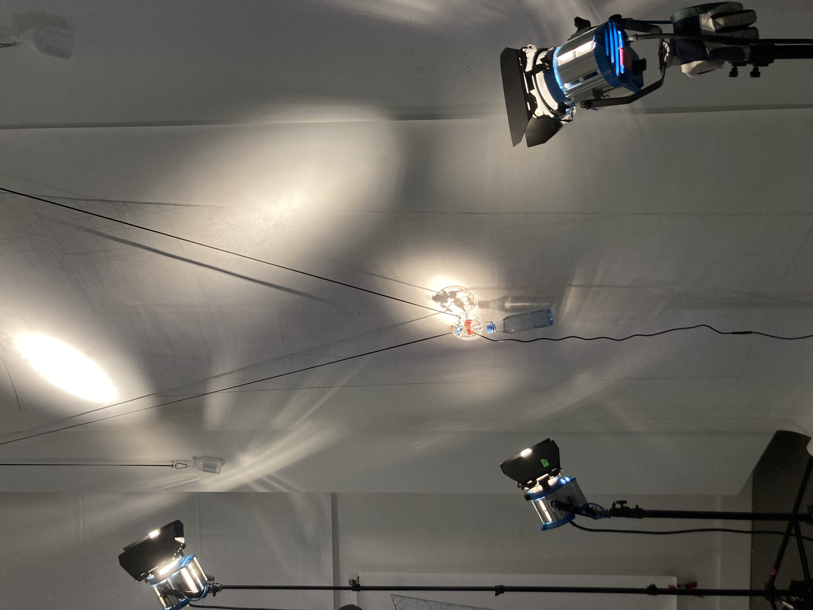

# Instrumentations

Project repository for the Instrumentations Studio 2021/22 

Design & Computation - University of the Arts, Berlin





## Setup

### Hardware
1. fix motor 1 to the left and motor 2 to the right
2. connect motors to fabscan shield sockets (left motor to 2 and and right motor to 1)
3. measure 'MOTOR_DIST': horizontal distance between motors
4. hang cables
5. add weights to pen and both ends
6. position pen at zero position
7. measure 'HOME_LEN': length of cables from pen to motor at zero position 
1. power to fabscan shield (12V)
2. connect arduino to laptop

### Arduino Setup
1. Install [AccelStepper](https://www.arduino.cc/reference/en/libraries/accelstepper/) library from the Arduino IDE
2. Upload and run *Arduino/PolargraphCalibration* to measure 'LEN_PER_STEP': the change in cable length in mm per motor step
3. Set 'MOTOR_DIST', 'HOME_LEN' and 'LEN_PER_STEP' in *Arduino/Polargraph*
4. Set limits and maxSpeed
5. Upload *Arduino/Polargraph* to arduino
   
## Python Setup
1. Install python3 and pip
2. Install python modules from the requirements by running `pip -r requirements.txt` inside the python folder 
3. Start the python script to control the polargraph (start the scripts from the root python directory and not the subfolder the script is in)

    >On Linux:
    >You might need to give permission to access the port the arduino is using by running 
    >use the name of the port the arduino board is plugged into (e.g. /dev/ttyACM0)
    >
    >```
    >sudo chmod a+rw /dev/ttyACM0
    >```


